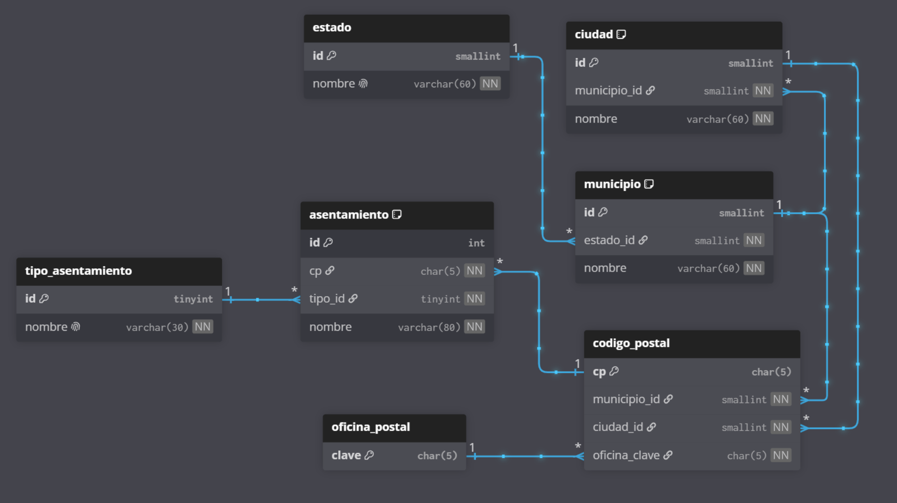

# SEPOMEX CDMX · BD MySQL 8.0 + ejercicios

Catálogo SEPOMEX (lote Ciudad de México, **1531 filas**) normalizado a **3FN** en
MySQL 8.0, con serie de ejercicios que practica `reglas.md`.

## Estructura

```
sepomex/
├── reglas.md                      # referencia de SQL / comparadores / joins
├── README.md
├── .env.example                   # variables solo para Docker
├── docker-compose.yml             # MySQL 8.0 en 3307 (no choca con local 3306)
├── db/                            # migraciones / DDL (fuente de verdad del modelo)
│   ├── 01_schema.sql              # DDL canónico (BD, tablas, FKs, vista)
│   ├── 02_load.sql                # ETL staging→3FN + verificación de conteos
│   └── sepomex.dbml               # modelo para dbdiagram.io (origen del ER en docs/)
├── data/                          # datos (crudo + procesado)
│   ├── CodigosPostales.xls        # origen (NO tocar; es HTML cp1252 con ext. .xls)
│   └── codigos_postales_cdmx.csv  # CSV UTF-8 (sin BOM) generado del .xls
├── docs/                          # diagramas e imágenes
│   ├── db2-sepomex.png            # ER renderizado
│   └── db2-sepomex.svg            # ER vectorial
├── scripts/
│   ├── convertir_xls_a_csv.py     # cp1252 → UTF-8, reproducible
│   └── cargar_local.ps1           # arranca MySQL80 + aplica 01 y 02
├── docker/
│   └── 02_seed.sh                 # seed inicial del contenedor
├── ejercicios/
│   └── ejercicios.sql             # 17 ejercicios enunciado+solución verificada
└── soluciones/
    └── resultados.md              # tabla de resultados capturados del servicio real
```

## Codificación (leer antes de tocar los datos)

- El `.xls` **no es Excel real**: es `<table>` HTML codificado en **Windows-1252**.
  Abrirlo como UTF-8 o con un lector XLS rompe los acentos (`Álvaro` → `Ãlvaro`).
- Flujo canónico: `scripts/convertir_xls_a_csv.py` lo lee como cp1252 y escribe
  `data/*.csv` en **UTF-8 estricto (sin BOM)**.
- La BD, las tablas y la carga usan `utf8mb4` + `utf8mb4_spanish_ci`
  (orden español, insensible a mayúsculas/acentos en `LIKE`/`ORDER BY`).
- `LOAD DATA` declara `CHARACTER SET utf8mb4` explícitamente.

## Modelo (3FN)

`estado → municipio → ciudad → codigo_postal → asentamiento`,
más `tipo_asentamiento` y `oficina_postal`.
`v_sepomex_plano` reconstruye el grano original (descomposición sin pérdida:
`COUNT(*) = 1531`).

| Tabla | Filas | Nota |
|---|---|---|
| estado | 1 | Ciudad de México |
| municipio | 16 | alcaldías |
| ciudad | 16 | una por alcaldía (decisión: cuelga de municipio → cadena de 4 JOINs) |
| tipo_asentamiento | 6 | Colonia 1271, Barrio 160, Pueblo 87, Equipamiento 9, Campamento 3, Aeropuerto 1 |
| oficina_postal | 45 | solo clave (el origen no trae nombre) |
| codigo_postal | 1110 | PK `CHAR(5)` (conserva `01389`); 1 CP = 1 municipio + 1 oficina (0 violaciones) |
| asentamiento | 1531 | UNIQUE `(cp, nombre, tipo_id)`: 4 nombres repetidos con distinto tipo (ej. CP 09870) |



> Fuente del diagrama: `db/sepomex.dbml` (vectorial en `docs/db2-sepomex.svg`).
> El DDL de `db/01_schema.sql` está verificado byte a byte contra la BD viva
> (`mysqldump --no-data` idéntico salvo contadores `AUTO_INCREMENT`).

## Vía A · MySQL local del equipo (principal)

Servicio `MySQL80` en **Manual**, puerto **3306**. Requiere PowerShell **como
administrador** (arrancar servicios exige elevación):

```powershell
# 1) Una vez: arrancar el servicio
Start-Service MySQL80

# 2) Carga completa (schema + CSV→3FN + conteos de verificación)
powershell -ExecutionPolicy Bypass -File .\scripts\cargar_local.ps1

# 3) Ejercicios
mysql -u root -p sepomex < ejercicios\ejercicios.sql

# Al terminar puedes devolverlo a Manual/detenido:
Stop-Service MySQL80
```

## Vía B · Docker (para quien no tiene el entorno del equipo)

```bash
cp .env.example .env   # opcional
docker compose up -d
docker compose logs -f db   # espera "seed OK"
mysql -h 127.0.0.1 -P 3307 -u sepomex -p sepomex < ejercicios/ejercicios.sql
docker compose down        # conserva datos; -v para borrarlos
```

Réplica exacta: imagen `mysql:8.0`, `utf8mb4_spanish_ci`, mismos scripts
(`01_schema.sql` + `02_load.sql` con ruta `/seed`).

## Verificación post-carga

`02_load.sql` termina con los conteos esperados:
`stg 1531 · estado 1 · municipio 16 · ciudad 16 · tipo 6 · oficina 45 ·
codigo_postal 1110 · asentamiento 1531 · v_sepomex_plano 1531`.

## Ejercicios

`ejercicios/ejercicios.sql`: 17 ejercicios (E01–E17) con **enunciado + solución
+ resultado esperado verificado** contra la BD real. Mapa a `reglas.md`:

- E01–E04: `LIKE` (contains / begin with / not contains / end with)
- E05–E08: `BETWEEN`, `NOT BETWEEN`, `IN`, `NOT IN` (+ agregación)
- E09–E11: `= > >= <= !=`, `AND`/`OR`, paréntesis
- E12–E16: `INNER JOIN`, `LEFT JOIN + IS NULL` (diferencia), `UNION` vs
  `UNION ALL` (314 vs 318: 4 nombres en común), `CROSS JOIN` (270)
- E17: integrador estilo reglas §3 (55 filas)
